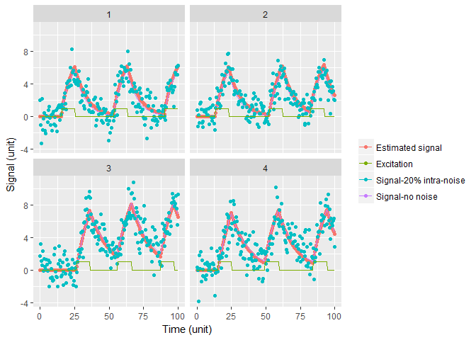

Examples
================
AU
11 mai 2018

Downloading of necessary libraries
----------------------------------

``` r
#setwd('yourworkingdirectory')
source('remi_smmr.R')
```

    ## 
    ## Attaching package: 'zoo'

    ## The following objects are masked from 'package:base':
    ## 
    ##     as.Date, as.Date.numeric

    ## Warning: package 'data.table' was built under R version 3.4.4

    ## Loading required package: Matrix

    ## Loading required package: lme4

    ## 
    ## Attaching package: 'lmerTest'

    ## The following object is masked from 'package:lme4':
    ## 
    ##     lmer

    ## The following object is masked from 'package:stats':
    ## 
    ##     step

``` r
library('ggplot2')
```

excitation\_function
--------------------

Random excitation pulses generation
===================================

Generation of three random pulses with amplitues 1, 5 and 10, with duration of 2,4 and 5 seconds with a total of Nf\*precision=100 points of measurement in 100 seconds, with a minimum spacing of 20 seconds between pulses.

``` r
exc <- excitation_function (amplitude = c(1,5,10), 
                            Nexc = 3, 
                            duration = c(2,4,5), 
                            Nf = 100, 
                            tmax = 100,
                            minspacing = 20,
                            precision = 10)

plot(exc$data$t,exc$data$y, xlab = "Time (s)", ylab = "Excitation (unit)")
```


calculate\_gold
---------------

Derivative calculation with uncorrelated errors
===============================================

Use of the Gold function for derivative calculation in the case of a simple quadratic function. It will be demonstrated that "holes" can be generated on the data and the function still manages to find the derivatives. 
The function chosen is:
*x*(*t*)=*t*<sup>2</sup>
 And its first and second derivatives: x' = 2t, x'' = 2

``` r
time <- c(1:500)/100
signal <- time^2
result <- calculate_gold(TimeSeries = signal, time = time, Embedding = 5)
#Puttin result data into a data table for easier plotting with ggplot
resulttable <-setDT(list(time=time,signal=signal,dtime=result$dtime,signal_rollmean=result$dsignal[,1],first_derivative=result$dsignal[,2],second_derivative=result$dsignal[,3]))
```

``` r
ggplot( data = resulttable ) +
theme_light() +
  geom_line(aes(time,signal, colour = "Signal"))+
  geom_point(aes(dtime,signal_rollmean, colour = "Signal rollmean in embedding points"))+
  geom_point(aes(dtime,first_derivative, colour = "First derivative"))+
  geom_point(aes(dtime,second_derivative, colour = "Second derivative"))+
  labs(x = "Time (unit)",
           y = "Signal (unit)",
           colour = "")
```

    ## Warning: Removed 4 rows containing missing values (geom_point).

    ## Warning: Removed 4 rows containing missing values (geom_point).

    ## Warning: Removed 4 rows containing missing values (geom_point).


``` r
#Generating holes in input signal
time <- c(1:50)/10
time <- time[sort(sample(seq(time), 0.6*length(time),replace = F))]
signal <- time^2
result <- calculate_gold(TimeSeries = signal, time = time, Embedding = 5)
resulttable <-setDT(list(time=time,signal=signal,dtime=result$dtime,signal_rollmean=result$dsignal[,1],first_derivative=result$dsignal[,2],second_derivative=result$dsignal[,3]))
```

``` r
ggplot( data = resulttable ) +
theme_light() +
  geom_line(aes(time,signal, colour = "Signal"))+
  geom_point(aes(dtime,signal_rollmean, colour = "Signal rollmean in embedding points"))+
  geom_point(aes(dtime,first_derivative, colour = "First derivative"))+
  geom_point(aes(dtime,second_derivative, colour = "Second derivative"))+
  labs(x = "Time (unit)",
           y = "Signal (unit)",
           colour = "")
```

    ## Warning: Removed 4 rows containing missing values (geom_point).

    ## Warning: Removed 4 rows containing missing values (geom_point).

    ## Warning: Removed 4 rows containing missing values (geom_point).


remi\_generate\_order1
----------------------

Generation of the solution to the first order differential equation (convolution)
=================================================================================

``` r
exc <- excitation_function(amplitude = 10,
                            Nexc = 3, 
                            duration = 5, 
                            Nf = 100, 
                            minspacing = 1,
                            precision = 10)

soleq <- remi_generate_order1(dampingTime = 30,
                              inputvec = exc$rawdata$y,
                              inputtim = exc$rawdata$t,
                              A = 1)
excdt <- setDT(exc$rawdata)
soleqdt <- setDT(soleq)
```

``` r
ggplot( ) +
theme_light() + theme(legend.position = "top") +
  geom_point(data = excdt, aes(t,y, colour = "Excitation (unit)"))+
  geom_point(data = soleqdt,aes(t,y, colour = "Convolution: solution to differential equation (unit)"))+
  labs(x = "Time (unit)",
           y = "Signal (unit)",
           colour = "")
```


simulation\_generate\_order1
----------------------------

Generation of several signals for several individuals that are solution to the first order differential equation
================================================================================================================

Generating simulation data for 4 individuals, with a damping time of 10 for an excitation vector formed by 3 excitations of amplitude 1 and duration 10 s distributed randomnly and with a sample of 200 points, with a minimum spacing between pulses of 20 s and with NO NOISE. That is, the signal follows exactly the theoretical solution of the differential equation and there is no variation of the damping time, the excitation coefficient and the equilibrium value across individuals:

``` r
# Generation of signals with no noise
mydata <- simulation_generate_order1(Nindividuals = 4, 
                                    dampingTime = 10, 
                                    amplitude = 1, 
                                    Nexc = 3, 
                                    duration = 10, 
                                    Nf = 200,
                                    tmax = 100,
                                    minspacing = 20,
                                    precision = 100,
                                    interNoise = 0, 
                                    intraNoise = 0)
```

If we add the following command we will be able to visualize the structure of mydata (the command "head" allows t visualize the first lines of the table, entering "mydata" directly will allow you to see the first and last lines).

``` r
head(mydata)
```

    ## $rawdata
    ##        ID excitation timecol Dampedsignalraw Dampedsignal
    ##     1:  1          0   0.000    1.515110e-15 1.515110e-15
    ##     2:  1          0   0.005    1.226408e-15 1.226408e-15
    ##     3:  1          0   0.010    1.623007e-15 1.623007e-15
    ##     4:  1          0   0.015    2.002016e-15 2.002016e-15
    ##     5:  1          0   0.020    7.016963e-16 7.016963e-16
    ##    ---                                                   
    ## 79996:  4          0  99.975    4.872905e+00 4.872905e+00
    ## 79997:  4          0  99.980    4.870469e+00 4.870469e+00
    ## 79998:  4          0  99.985    4.868035e+00 4.868035e+00
    ## 79999:  4          0  99.990    4.865601e+00 4.865601e+00
    ## 80000:  4          0  99.995    4.863169e+00 4.863169e+00
    ## 
    ## $data
    ##      ID excitation timecol Dampedsignalraw  Dampedsignal
    ##   1:  1          0     0.0    1.515110e-15  1.515110e-15
    ##   2:  1          0     0.5    1.032251e-15  1.032251e-15
    ##   3:  1          0     1.0   -1.697583e-15 -1.697583e-15
    ##   4:  1          0     1.5   -1.517615e-16 -1.517615e-16
    ##   5:  1          0     2.0   -2.295254e-15 -2.295254e-15
    ##  ---                                                    
    ## 796:  4          0    97.5    6.241311e+00  6.241311e+00
    ## 797:  4          0    98.0    5.936919e+00  5.936919e+00
    ## 798:  4          0    98.5    5.647372e+00  5.647372e+00
    ## 799:  4          0    99.0    5.371946e+00  5.371946e+00
    ## 800:  4          0    99.5    5.109954e+00  5.109954e+00

Where: ID is the identifier of the individual excitation is the excitation signal Dampedsignalraw is the signal without noise Dampedsignal is the signal with noise timecol is the time column generated.

Plotting data:

``` r
ggplot( data = mydata$data ) +
  geom_point(aes(timecol,Dampedsignalraw, colour = "Signal-no noise"))+
  geom_point(aes(timecol,Dampedsignal, colour = "Signal with 0% intra-noise"))+
  geom_line(aes(timecol,excitation,colour = "Excitation"))+
  facet_wrap(~ID)+
  labs(x = "Time (unit)",
           y = "Signal (unit)",
           colour = "")
```


Using the same function, this time adding a 20% intra-individual noise and a 40% inter-individual noise:

``` r
# Generation of signals with intra and inter-noise
mydata <- simulation_generate_order1(Nindividuals = 4, 
                                    dampingTime = 10, 
                                    amplitude = 1, 
                                    Nexc = 3, 
                                    duration = 10, 
                                    Nf = 200,
                                    tmax = 100,
                                    minspacing = 20,
                                    precision = 100,
                                    interNoise = 0.4, 
                                    intraNoise = 0.2)
```

    ## Warning in excitation_function(amplitude, Nexc, duration, Nf, tmax, minspacing, : Due to input parameters introduced, vector size was larger than Npoints and was cut to this value.

Plotting data:

``` r
ggplot( data = mydata$data ) +
  geom_point(aes(timecol,Dampedsignalraw, colour = "Signal-no noise"))+
  geom_point(aes(timecol,Dampedsignal, colour = "Signal with 20% intra-noise"))+
  geom_line(aes(timecol,excitation,colour = "Excitation"))+
  facet_wrap(~ID)+
  labs(x = "Time (unit)",
           y = "Signal (unit)",
           colour = "")
```


remi\_analyse\_order1
---------------------

Study of input signals to indicate how well it fits a first order differential equation through multilevel regression
=====================================================================================================================

Next, the signals with noise presented above will be analyzed in order to verify that the damping coefficient was the one introduced in the simulation function and that the estimated signal generated matches the original one:

``` r
result <- remi_analyse_order1(UserData = mydata$data,
                                ID = "ID",
                                Input="excitation",
                                Time="timecol",
                                signalcolumn = "Dampedsignal",
                                Embedding = 5)
```

    ## summary from lme4 is returned
    ## some computational error has occurred in lmerTest

Now let's take a look to the different parts of the result. As it was mentioned before, the first table contains the original data with some columns added. These columns contain intermediate variables used for the preparation of the regression:

``` r
head(result$data)
```

    ##    ID excitation timecol Dampedsignalraw Dampedsignal
    ## 1:  1          0     0.0    2.642503e-15   -0.4343923
    ## 2:  1          0     0.5    1.118451e-15    0.4677046
    ## 3:  1          0     1.0   -2.724310e-15    1.0095553
    ## 4:  1          0     1.5   -5.190502e-16   -0.9676222
    ## 5:  1          0     2.0   -1.659145e-15    1.0766585
    ## 6:  1          0     2.5    1.668510e-15    2.1786554
    ##    Dampedsignal_rollmean Dampedsignal_derivate1 timecol_derivate
    ## 1:             0.2303808              0.3173550              1.0
    ## 2:             0.7529903              0.6978009              1.5
    ## 3:             1.2402319              1.3869983              2.0
    ## 4:             0.9103133              0.4964845              2.5
    ## 5:             1.1941587             -0.8137600              3.0
    ## 6:             1.0506534             -1.2182709              3.5
    ##    excitation_rollmean Dampedsignal_estimated
    ## 1:                   0             -0.4544413
    ## 2:                   0             -0.4544413
    ## 3:                   0             -0.4544413
    ## 4:                   0             -0.4544413
    ## 5:                   0             -0.4544413
    ## 6:                   0             -0.4544413

Where: Dampedsignal\_rollmean contains the roll mean (moving average) values of the input signal in embedding points. As it can be seen, the first line contains an NA because the convolution takes the points to the left and thus the first roll means can't be calculated as there are no points to the left of these.

Dampedsignal\_derivate1 contains the first derivate of Dampedsignal, calculated by using the calculate\_gold function. The first line contains an NA for the same reason as the previous column.

timecol\_derivate contains the values of time in which the derivative has been evaluated.

excitation\_rolled contains the roll mean of the excitation signal in embedding points.

Dampedsgnal\_estimated contains the values of the estimated signal generated by using the remi\_generate\_order1 function and using the coefficients calculated for each individual (see next table).

``` r
result$resultID
```

    ##    ID Dampedsignal_dampingTime Dampedsignal_eqvalue excitation_exccoeff
    ## 1:  1                 12.77795           -0.4544413            12.42467
    ## 2:  2                 12.77795           -0.9284684            13.00726
    ## 3:  3                 12.77795           -0.5813915            12.58069
    ## 4:  4                 12.77795           -0.2991674            12.23375

Where for each individual we have:

Excitation\_exccoeff which is the coefficient of the excitation term.

Dampedsignal\_dampingTime which is the inverse of the damping coefficient.

Dampedsignal\_eqvalue which is the equilibrium value.

(for more details, visit the wiki pages)

Finally, the third table contains the average of these coefficients for all the individuals:

``` r
result$resultmean
```

    ##     ID Dampedsignal_dampingTime Dampedsignal_eqvalue excitation_exccoeff
    ## 1: All                 10.71671            -0.474586            10.53526
    ##    Dampedsignal_fitmsg
    ## 1:                <NA>

And, if we want to see in detail the results of the regression, the following command applies:

``` r
result$regression
```

    ## [[1]]
    ## Linear mixed model fit by REML ['lmerMod']
    ## Formula: 
    ## Dampedsignal_derivate1 ~ Dampedsignal_rollmean + excitation_rollmean +  
    ##     (1 + excitation_rollmean + Dampedsignal_rollmean | ID)
    ##    Data: Data
    ## Control: lmerControl(calc.derivs = FALSE, optimizer = "nloptwrap")
    ## 
    ## REML criterion at convergence: 1756
    ## 
    ## Scaled residuals: 
    ##     Min      1Q  Median      3Q     Max 
    ## -3.5097 -0.7001  0.0127  0.6425  3.2877 
    ## 
    ## Random effects:
    ##  Groups   Name                  Variance  Std.Dev. Corr       
    ##  ID       (Intercept)           0.0005194 0.02279             
    ##           excitation_rollmean   0.0007854 0.02802  -1.00      
    ##           Dampedsignal_rollmean 0.0015471 0.03933   1.00 -1.00
    ##  Residual                       0.5368017 0.73267             
    ## Number of obs: 784, groups:  ID, 4
    ## 
    ## Fixed effects:
    ##                       Estimate Std. Error t value
    ## (Intercept)           -0.04428    0.04484  -0.988
    ## Dampedsignal_rollmean -0.09331    0.02492  -3.745
    ## excitation_rollmean    0.98307    0.06749  14.565
    ## 
    ## Correlation of Fixed Effects:
    ##             (Intr) Dmpds_
    ## Dmpdsgnl_rl -0.193       
    ## excttn_rllm -0.167 -0.407
    ## 
    ## [[2]]
    ## $ID
    ##    (Intercept) excitation_rollmean Dampedsignal_rollmean
    ## 1  0.008720166        -0.010715690           0.015052372
    ## 2 -0.028377109         0.034878049          -0.048988117
    ## 3 -0.001214930         0.001494763          -0.002098374
    ## 4  0.020871874        -0.025657122           0.036034120

Where we have a summary of the random and fixed effects and the residuals calculated by the function lmer. Apart from these indicators, if we graphically wish to verify how the estimated signal fits the initial signal, we call ggplot once again:

``` r
ggplot( data = result$data ) +
  geom_point(aes(timecol,Dampedsignal_estimated, colour = "Estimated signal"))+
  geom_line(aes(timecol,Dampedsignalraw, colour = "Signal-no noise"))+
  geom_point(aes(timecol,Dampedsignal, colour = "Signal-20% intra-noise"))+
  geom_line(aes(timecol,excitation,colour = "Excitation"))+
  facet_wrap(~ID)+
  labs(x = "Time (unit)",
           y = "Signal (unit)",
           colour = "")
```


